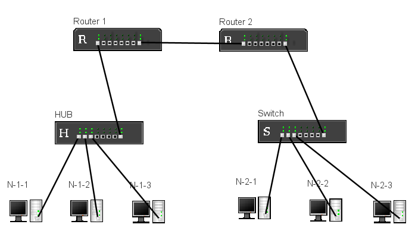

**Компьютерные сети**
## Лабораторная работа №2 (2 ч)

**Тема:** Построение простой компьютерной сети в Net Simulator.

**Цель работы:** Изучить основные принципы построения компьютерных сетей и функциях ключевого оборудования (коммутатора и маршрутизатора) путём создания и настройки простой локальной сети в симуляторе Net Simulator.

### Теоретические сведения

#### Топология компьютерной сети

**Топология компьютерной сети** описывает физическое или логическое расположение и соединение всех элементов сети (узлов, устройств связи). Она определяет, каким образом узлы подключены друг к другу.

**Узел (Node)** - это любое устройство, которое может отправлять, получать или перенаправлять информацию в сети. Это могут быть конечные узлы (компьютеры, серверы, принтеры) или сетевые устройства (маршрутизаторы, коммутаторы).

**Сетевой интерфейс (Network Interface)**, часто называемый **сетевой платой (NIC)**, представляет собой аппаратное устройство (или его логическое представление), которое позволяет узлу подключаться к среде передачи данных (кабелю или беспроводному каналу) и передавать/получать данные. Каждый сетевой интерфейс имеет уникальный MAC-адрес.

Для эффективной работы сети используются специализированные устройства:
- **Концентратор (Hub):** устаревшее устройство, работающее на физическом уровне (Уровень 1 модели OSI). Он принимает сигнал от одного порта и повторяет его на всех остальных портах, не фильтруя трафик
- **Коммутатор (Switch):** более современное и интеллектуальное устройство, работающее на канальном уровне (Уровень 2 модели OSI). Коммутатор изучает MAC-адреса подключённых узлов и строит **таблицу MAC-адресов**. Благодаря этой таблице он может перенаправлять данные только на тот порт, к которому подключён узел-получатель, тем самым значительно снижая ненужный трафик
- **Маршрутизатор (Router):** устройство, работающее на сетевом уровне (Уровень 3 модели OSI). Его основная функция - соединять различные сети (например, домашнюю сеть с интернетом) и определять оптимальный **маршрут** для пакетов данных, основываясь на их **IP-адресах**
    
#### Маршрутизация
**Таблица маршрутизации (Routing Table)** - это база данных, хранящаяся в маршрутизаторе. Она содержит информацию, необходимую для принятия решения о том, куда следует перенаправить пакет данных, чтобы он достиг своего адресата в другой сети.

Таблица маршрутизации обычно включает следующую ключевую информацию:
- **Сеть назначения (Destination Network):** адрес сети, к которой направляется пакет
- **Маска сети (Netmask):** используется для определения диапазона IP-адресов в сети назначения
- **Шлюз (Gateway) или Следующий хоп (Next Hop):** IP-адрес маршрутизатора, которому следует передать пакет далее
- **Интерфейс (Interface):** локальный интерфейс маршрутизатора, через который должен быть отправлен пакет
- **Метрика (Metric):** числовое значение, используемое для определения "лучшего" маршрута, если к сети назначения существует несколько путей
    
Когда маршрутизатор получает пакет, он смотрит на IP-адрес назначения пакета и сравнивает его с записями в своей таблице маршрутизации, чтобы выбрать наиболее подходящий маршрут и переслать пакет далее.

#### Команды для настройки сети
Просмотр списка сетевых интерфейсов:
```
ifconfig -a
```

Просмотр списка маршрутов:
```
route
```

Настройка адреса сетевого интерфейса:
```
ifconfig <interface> <ip_address> -netmask <mask> -up
```
где:
- `<interface>` - имя сетевого интерфейса
- `<ip_address>` - адрес, задаваемый сетевому интерфейсу
- `<mask>` - маска подсети

Для того, чтобы хост отправлял все пакеты, которые не предназначены локальной сети (во внешнюю сеть), необходимо указать, что он должен их отправлять на маршрутизатор:

```
route -add 0.0.0.0 -netmask 0.0.0.0 -gw <gateway_address> -dev <interface>
```
где:
- `<gateway_address>` - адрес маршрутизатора, на который нужно отправлять пакеты
- `<interface>` - имя сетевого интерфейса, через который нужно отправлять пакеты (интерфейс хоста, а не маршрутизатора)

Маршрутизатору также необходимо добавить маршруты для пакетов, если необходимо переслать их в другую подсеть:
```
route -add <subnet_address> -netmask <mask> -gw <gateway_address> -dev <interface>
```
где:
- `<subnet_address>` - адрес подсети
- `<mask>` - маска подсети
- `<gateway_address>` - адрес маршрутизатора, на который нужно отправлять пакеты
- `<interface>` - имя сетевого интерфейса, через который нужно отправлять пакеты

Рекомендуется у маршрутизатора устанавливать последний октет 1, у хостов - начиная с 100.

### Задание

Построить в Net Simulator простую компьютерную сеть:
- две подсети, соединенные двумя маршрутизаторами
- в первой подсети компьютеры объединены с помощью концентратора (HUB)
- во второй подсети компьютеры объединены с помощью коммутатора (Switch)

Запустите Net Simulator и создайте новый проект. Постройте следующую схему компьютерной сети:

<p align="center">
  
</p>

Для каждого компьютера и маршрутизатора настройте сетевые интерфейсы с использованием команды `ifconfig` (маска подсети для всех одинаковая: `255.255.255.0`):
- компьютер N-1-1:
	- интерфейс `eth0`: адрес `192.168.1.101`
- компьютер N-1-2:
	- интерфейс `eth0`: адрес `192.168.1.102`
- компьютер N-1-3:
	- интерфейс `eth0`: адрес `192.168.1.103`
- компьютер N-2-1:
	- интерфейс `eth0`: адрес `192.168.2.101`
- компьютер N-2-2:
	- интерфейс `eth0`: адрес `192.168.2.102`
- компьютер N-2-3:
	- интерфейс `eth0`: адрес `192.168.2.103`
- роутер 1:
	- интерфейс `eth0`: адрес `192.168.1.1`
	- интерфейс `eth7`: адрес `192.168.30.1`
- роутер 2:
	- интерфейс `eth0`: адрес `192.168.30.2`
	- интерфейс `eth7`: адрес `192.168.2.1`

Пример команды для компьютера N-1-1:
```
ifconfig eth0 192.168.1.101 -netmask 255.255.255.0 -up
```

Проверьте доступность компьютеров в подсетях (например, на компьютере N-1-1 выполните команду `ping` для проверки доступности компьютера N-1-3).

Пример команды:
```
ping 192.168.1.103
```

Настройке маршрутизацию на компьютерах так, чтобы они отправляли все пакеты, которые не предназначены компьютерам в одной и той же подсети (во внешнюю сеть), на маршрутизатор.

Пример команды для компьютера N-1-1:
```
route -add 0.0.0.0 -netmask 0.0.0.0 -gw 192.168.1.1 -dev eth0
```

Далее необходимо настроить маршрутизаторы. Для маршрутизатора Router 1 необходимо указать, что пакеты, предназначенные для второй подсети (`192.168.2.0`) необходимо перенаправлять на маршрутизатор Route 2. Аналогично и для маршрутизатора Route 2.

Пример команды для Router 1:
```
route -add 192.168.2.0 -netmask 255.255.255.0 -gw 192.168.30.2 -dev eth7
```
примечание:
- `192.168.2.0` - адрес подсети назначения
- `192.168.30.2` - адрес маршрутизатора (Route 2), на который необходимо перенаправить пакет
- `eth7` - имя сетевого интерфейса (у Route 1), который связан с маршрутизатором Route 2

Теперь проверьте доступность компьютеров. Например, попробуйте на компьютере N-1-3 выполнить команду `ping` для проверки доступности компьютера N-2-1.

### Отчет по лабораторной работе должен содержать

1. Цель и задачи работы.
2. Архитектура и описание спроектированной компьютерной сети.
3. Описание выполненных этапов и скриншоты с результатами выполнения. 
4. Вывод по выполненной работе

### Список вопросов на защиту

1. В чём принципиальное различие между концентратором (Hub) и коммутатором (Switch) с точки зрения обработки данных?
2. Какова основная функция маршрутизатора (Router) в сети?
3. Что представляет собой узел (Node) в контексте компьютерной сети? Приведите примеры.
4. Что такое сетевой интерфейс (Network Interface) и какой уникальный адрес он имеет?
5. Зачем маршрутизатору нужна Таблица маршрутизации (Routing Table)?